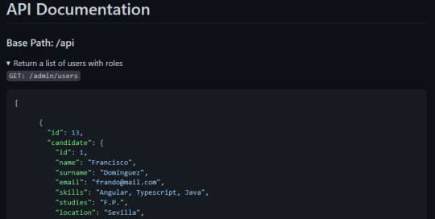
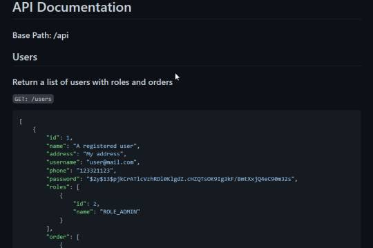
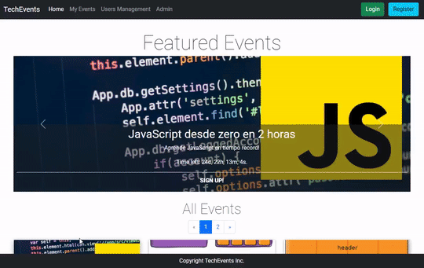
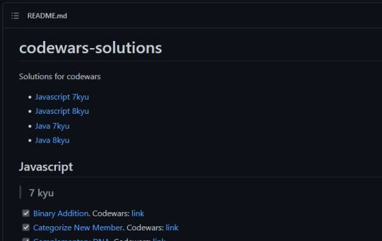

<h1 align="center">Hi 👋, I'm Jesús</h1>

<h3 align="center">A passionate Fullstack dev from Spain</h3>

Learning and technology is my passion. I love how technology and programming is becoming more accessible to everyone and help us find new unique solutions.

<h1 align="center">My Projects</h1>
<table>

  <tr>
    <td width="50%" valign="top">
      <h3 align="center">Selection Process Frontend</h3>
         
        
         
        

          
    
  
      

        
<strong>Angular, Typescript, Angular Material, CSS, PDFMake, JsPDF, SheetJS, ChartJS</strong> - Selection process management app. Can export data as PDF or XLS.

    </td>
    <td width="50%" valign="top">
      <h3 align="center">Selection Process Backend</h3>
         
      
         
        

          
  
  
      

        
<strong>Java, Spring Boot, Spring Security, JWT, MySQL, JavaMail</strong> - Backend for Selection Process app. Sends email to confirm interview and has a stats endpoint.

    </td>
  </tr>
  
  <tr>
    <td width="50%" valign="top">
      <h3 align="center">BurgerPalace</h3>
         
        
         
        

          
    
  
      

        
<strong>Angular, Typescript, Javascript, Bootstrap, CSS</strong> - Frontend made using Angular framework for our backend. Heroku deploy uses Express.

    </td>
    <td width="50%" valign="top">
      <h3 align="center">BurgerPalace Backend</h3>
         
      
         
        

          
  
  
      

        
<strong>Java, Spring Boot, Spring Security, JWT, MySQL</strong> - Backend for BurgerPalace. Heroku deploy uses PostgreSQL.

    </td>
  </tr>
  
  <tr>
    <td width="50%" valign="top">
      <h3 align="center">TechEvents</h3>
       
        
       
        

  
  
      

        
<strong>Java, Spring Boot, Spring Security, Thymeleaf, Bootstrap</strong> - App to manage events. Admin can do CRUD of events and users. Users can add/remove themselves from events if there are any free spot. It has a history of past events.

    </td>
    <td width="50%" valign="top">
      <h3 align="center">Katas / Codewars</h3>
         
        
         
        

          
  
  
      

        
<strong>Javascript, Java</strong> - I like to do a kata every day.

    </td>
  </tr>
</table>

<h1 align="center">Technologies & Tools</h1>

 
     
     
     
     
     
     
     
     
     
    
     
     
     
     
     
     
     
    
     

<h1 align="center">Stats</h1>

